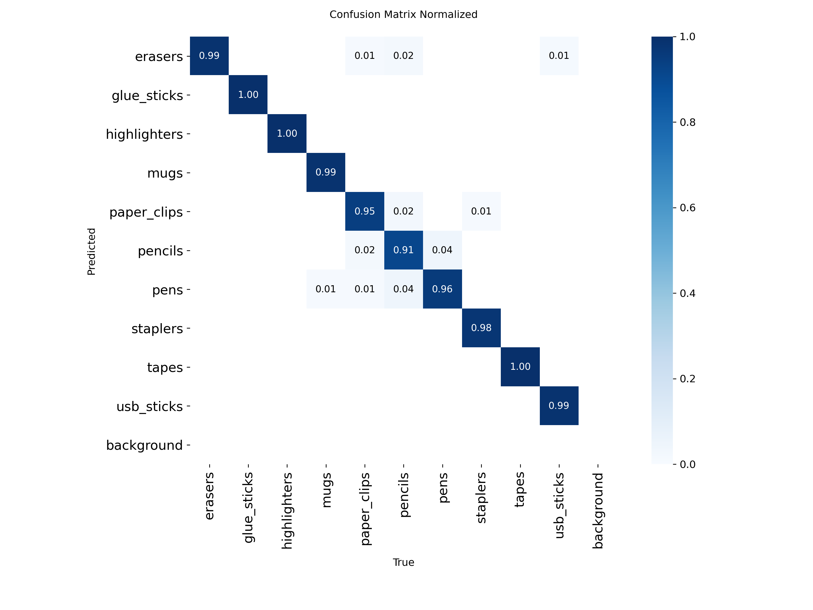
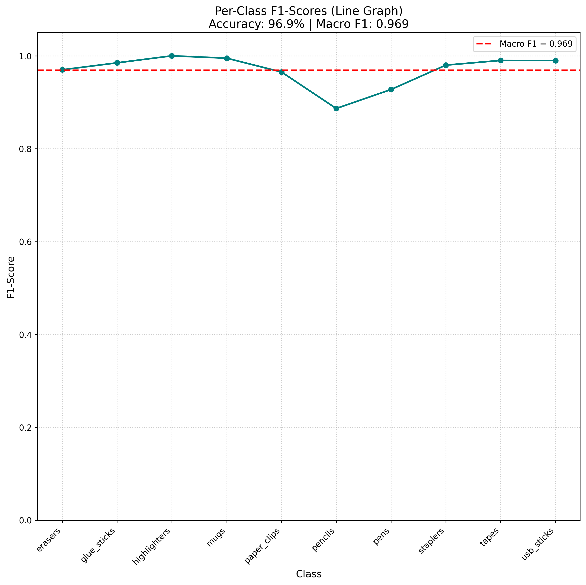
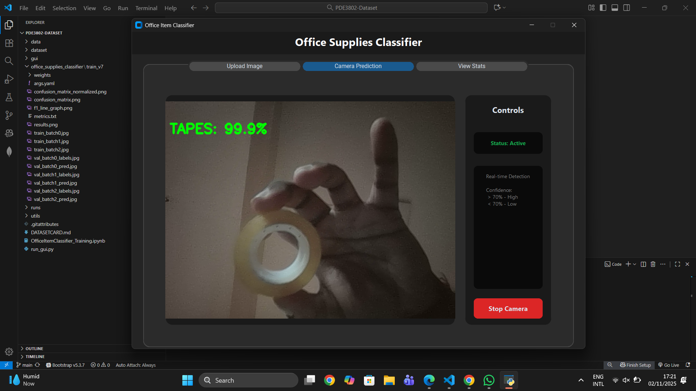
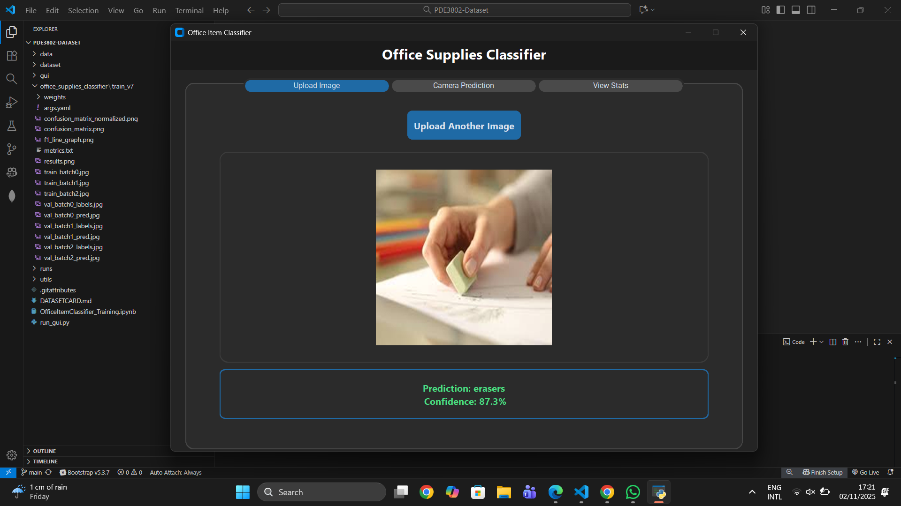

# Office Item Classifier. 
The goal was to classifies common office supplies into 10 categories using a custom dataset and **YOLOv8 Large Classification Model**.
---
## Project Overview
- ** Title:** Write a software that recognise an office item class from a single image or live camera frame (one item at time).
- **Objective:** Classify 10 common office items with high accuracy using computer vision and AI.
- **Course:** Artificial Intelligence (AI) in Robotics 2025-26 [PDE 3802].
- **Dataset:** 37,950 images, balanced across 10 classes.
- **Pre-trained Model:** YOLOv8 L, trained with extensive augmentation and transfer learning.
---
## Features

### Dataset & Preprocessing
- 37,950 images across 10 office item classes.
- Video-to-frame extraction for dataset creation.
- Stratified 70/20/10 train/val/test split.
- Static & dynamic augmentation (rotation, HSV shifts, flip, Mixup, random erasing, AutoAugment, crop).

### Model Training
- YOLOv8 L Classification with pretrained weights.
- Automatic generation of data.yaml for dataset paths & class labels.
- Optimised hyperparameters: learning rate, batch size, dropout, label smoothing.
- GPU / CPU automatic selection.

### GUI & Inference
- Single image classification or live webcam detection.
- Built-in metrics dashboard (accuracy, macro F1, confusion matrix, F1-line graph).

---

## Intallation

### 1. Clone Repository
```bash
git clone https://github.com/SaahilTakooree/PDE3802-Dataset.git
cd PDE3802-Dataset
```

The structure of the file should look like this:
```kotlin
data/
|-train/
|   |- erasers
|   |- glue_sticks
|   |- highlighters
|   |- mugs
|   |- paper_clips
|   |- pencils
|   |- pens
|   |- staplers
|   |- tapes
|   |- usb_sticks
|   |- val/
|   |- test/
|-val/
|   |- erasers
|   |- glue_sticks
|   |- highlighters
|   |- mugs
|   |- paper_clips
|   |- pencils
|   |- pens
|   |- staplers
|   |- tapes
|   |- usb_sticks
|   |- val/
|   |- test/
|-test/
|   |- erasers
|   |- glue_sticks
|   |- highlighters
|   |- mugs
|   |- paper_clips
|   |- pencils
|   |- pens
|   |- staplers
|   |- tapes
|   |- usb_sticks
|   |- val/
|   |- test/
dataset/
|- erasers
|- glue_sticks
|- highlighters
|- mugs
|- paper_clips
|- pencils
|- pens
|- staplers
|- tapes
|- usb_sticks
gui
|-services
|   |-model_service.py
|-views
|   |-camera_tab.py
|   |-main_menu.py
|   |-stats_tab.py
|   |-upload_tab.py
|- app.py
office_supplies_classifier/
├── train_v7/
utils
|   |- augment_data.py
|   |- extract_frames.py
|   |- file_renamer.py
|   |- split_dataset.py
.gitattributes
.DATASETCARD.md
OfficeItemClassifier_Training.ipynb
README.md
run_gui.py
````

### 2. Install Dependencies
```bash
pip install opencv-python==4.10.0 \
            numpy==2.1.2 \
            tqdm==4.67.1 \
            scikit-learn==1.7.2 \
            torch==2.9.0+cpu \
            ultralytics==8.3.218 \
            customtkinter==5.2.2 \
            Pillow==11.0.0 \
            PyYAML==6.0.2 \
            matplotlib==3.9.2
```

#### Torch install

##### Nvidia GPUs
Check your CUDA version:
``` bash
nvidia-smi
```
If your nvidia-smi shows CUDA 12.x (most modern systems), use: 
```bash
pip install torch==2.9.0 torchvision torchaudio --index-url https://download.pytorch.org/whl/cu121
```
If your system supports only CUDA 11.x:
```bash
pip install torch==2.9.0 torchvision torchaudio --index-url https://download.pytorch.org/whl/cu118
```
The cu121 or cu118 part means “built for CUDA 12.1” or “CUDA 11.8”.

##### AMD GPUs (ROCm)
If you have an AMD GPU instead, use:
```bash
pip install torch==2.9.0 torchvision torchaudio --index-url https://download.pytorch.org/whl/rocm6.0
```

#### For CPU-only  
```bash
pip install torch==2.9.0 --index-url https://download.pytorch.org/whl/cpu
```

---

## Usage
### 1. Using Pre-trained Model

Open a terminal (Command Prompt, PowerShell, or your IDE terminal).

Navigate to the root directory of the project, where run_gui.py is located — in this case, the PDE3802-Dataset folder.

Run the GUI:
``` bash
python run_gui.py
```
- Automatically uses GPU if available, otherwise CPU.
- Input options:
    - Single image from disk
    - Live webcam feed (one office item per frame)


Pre-trained weights location:
``` bash
PDE3802-Dataset/office_supplies_classifier/train_v7/weights/best.pt
```

```
- Automatically uses GPU if available, otherwise CPU.
- Input options:
    - Single image from disk
    - Live webcam feed (one office item per frame)

Pre-trained weights location:
``` bash
PDE3802-Dataset/office_supplies_classifier/train_v7/weights/best.pt
```

### 2. Viewing Model Metrics

Metrics saved in train_v7 folder:

|File|Description|
|-|-|
|confusion_matrix_normalized.png|	Normalised class-wise confusion matrix|
|results.png|Accuracy & Macro F1 overview|
|metrics.txt|Detailed numeric metrics (precision, recall, F1-score per class)|

### 3. Training the Model

1. Open the Jupyter Notebook:
```kotlin
OfficeItemClassifier_Training.ipynb
```

2. Click Run All. The notebook will:
- Generate data.yaml automatically
- Install missing libraries if necessary
- Download YOLOv8 pre-trained model
3. Start training with defined hyperparameters & augmentation

---

## Example Output:

**Metrics**
```txt
OFFICE SUPPLIES CLASSIFIER - ACCURACY REPORT
==================================================
Model: office_supplies_classifier/train_v7/weights/best.pt
Accuracy: 0.969000 (96.90%)
Macro F1-Score: 0.968921

Classification Report:
                 precision    recall  f1-score   support

        erasers    0.97    0.97    0.97       100
    glue_sticks    0.99    0.98    0.98       100
   highlighters    1.00    1.00    1.00       100
           mugs    1.00    0.99    0.99       100
    paper_clips    0.96    0.97    0.97       100
        pencils    0.91    0.86    0.89       100
           pens    0.90    0.96    0.93       100
       staplers    0.98    0.98    0.98       100
          tapes    0.98    1.00    0.99       100
     usb_sticks    1.00    0.98    0.99       100

       accuracy                       0.97      0
      macro avg    0.97    0.97    0.97      1000
   weighted avg    0.97    0.97    0.97      1000

```

**Confusion Matrix:**  


**F1 Score:**  


**Result:**  


**GUI Examples:**  



---
## Troubleshooting
1. **Model Not Found:** Ensure best.pt exists at train_v7/weights/best.pt.

2. **GPU Issues:** Check CUDA version (nvidia-smi) or ROCm and install matching PyTorch build. CPU fallback works automatically.
3. **Missing Libraries: Make sure **all required libraries are installed** and at the **correct versions**.

4. **Notebook Errors:** Run all cells in order; verify dataset path.

5. **GUI Issues:** Ensure Python 3.12.6, close other webcam apps.

6. **Classification Errors:** Use focused, single-item images; retrain with augmentations if needed.

7. **Webcam Detection Issues:**
    - Make sure the background is blank or uncluttered.
    - Ensure the object fully fits in the frame and is well-lit.
    - Avoid multiple objects or partially occluded items during detection.
